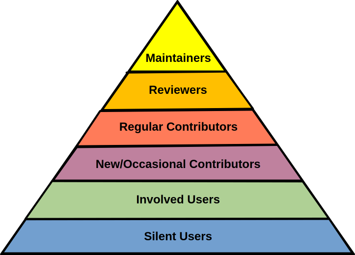
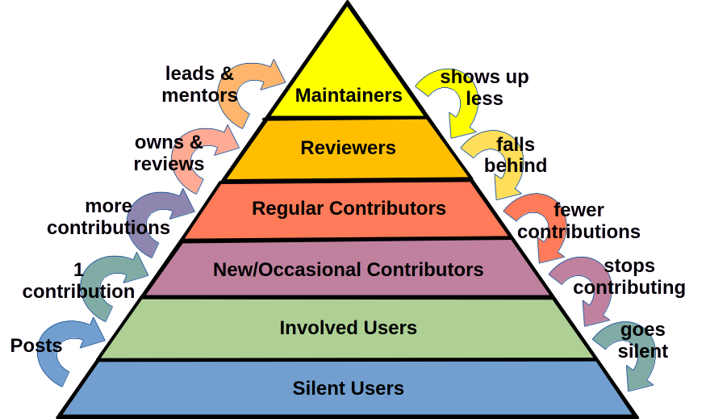

# The Contributor Pyramid

Any healthy, well-staffed open source project with more than a couple dozen participants can be described as a Contributor Pyramid.  This model looks at the amount of involvement people have with the project from least (bottom) to full-time commitment (top), as well as their authority and responsibility.  

The reason we use a pyramid instead of a ladder is to remind ourselves that lower levels have many more people in them.  In terms of contributor recruitiment and development, it take dozens to hundreds of users to produce one new maintainer.  If we were looking at it by the volume of contributions, it would be an inverted pyramid, as for most projects the maintainers are responsible for the majority of total contributions.

This makes this model useful for developing our strategy around evolving the project. As you proceed with your open source project you are looking to build out a healthy, robust, growing or at least stable pyramid.  This model defines the structure of the rest of this book; each of the sections can be thought of in terms of which level of the pyramid you're working on.

Let's explore levels of this pyramid from bottom to top:

## Users

### Silent Users 

These are the people and organizations who use your project, but do not have any contact with the project community other than downloading software.  Often they use the project as a dependency of some other piece of software.  Others may be enthusiastic about the software, but unaware or unwilling to make contact.  For popular software, these are the vast majority of users, but until they become Involved Users their identity is unknown and their existence strictly statistical.

As Silent Users are not self-identified, criteria is important.  Your project's users include anyone who has sufficient contact with your software to make distinctions between it and alternative software.  For example, for a Kubernetes Operator, estimated silent users would include Kubernetes admins where the Operator is deployed, and software developers who build applications utilizing the Operator, but would not include users of those applications.  This is potentially a different definition than marketing staff would use, since here we are concerned with users who are potential contributors, and people who have no direct contact with your software simply aren't.

Characterizing Silent Users:

* Do not have any community contact
* Must be inferred from: 
  * downloads
  * usage stats of dependent projects
  * surveys
  * mentions of the project in job listings
  
Note that the last indicator is trailing; job listings about a technology tend to run 6-24 months behind the actual popularity of that technology.

### Involved Users

Some minority of your users can become involved with the project.  This includes participating in community forums, attending meetups and conferences, filing and commenting on bug reports, filling out surveys, or interacting with contributors in social media.  They may mention your project in articles, videos, and on social media. These are the users that you know about.

Involved users are characterized by:

* Participating in community forums
* Filing or commenting on bug reports
* Filling out surveys with usage details
* Speaking as users in community presentations
* Attending and identifying themselves at community events

## Contributors

### New/Occasional Contributors 

These are users who have just made their first contribution to the project, and users who contribute infrequently. Often they are people who are contributing "in their spare time" and don't really think of themselves as members of the project.  Others may only contribute in a very specific, narrow area of the project that suits their interests or skills. 

The difference between an Involved User and an Occasional Contributor is their activities in helping others in the project.  For example, someone who reports their own bug is an Involved User, but someone who works with the testing team for weeks to develop a test to detect that bug is an Occasional Contributor.

For the Pyramid and community relations we don't need to differentiate between new and occasional users; in both cases you are looking to advance them to Regular Contributors.  New/Occasional contributor activity is also a good measure of how effective your contributor documentation and processes are, as high levels of occasional contributor activity indicate a very approachable project.

Characterizing New/Occasional Contributors:

* Have only 1-3 contributions in the last #X months
* Contributions are generally small/simple
* Have no assigned project responsibilities
* Rarely or never attend contributor meetings

### Regular Contributors

Contributors who contribute frequently, but do not hold any position of authority in the project.  These contributors make comments, submit minor fixes, and offer input in community decisions regularly but not in any great volume.  They do not usually attempt any large or complicated changes, but may volunteer for low-intensity regular responsibilities (like forum moderation or issue triage).

Regular Contributors are characterized by:

* More than #X contributions per month for #X months
* May have minor assigned responsibilities (e.g. team member, channel moderator)
* Sometimes attend contributor meetings, but don't generally lead them
* Occasionally participate in reviewing other's contributions

## Leaders

### Reviewers

Also known as Subproject Owners, Plugin Maintainers, Team Leads, and many other roles, all medium-to-large projects have defined roles with authority which are below Project Maintainers.  Sometimes this means being the owner of some specific, narrowly-scoped piece of the project (e.g. Security Response Team member), and sometimes it means having the ability to review contributions but not merge them, or only merge them in very specific areas. 

Basically, if someone is a Regular Contributor with a critical named role and responsibilities they are probably a Reviewer.  Additionally, Regular Contributors who frequently spend time reviewing and mentoring other contributors are Reviewers as well.  Small projects will not really have identifiable Reviewers, as anyone above the level of Regular Contributor will advance to Maintainer.

Reviewers are characterized by:

* More than #X contributions per month for #X months (should be 2-3X the volume of Regular Contributors)
* Have a few assigned key roles (e.g. team lead, subproject approver)
* Frequently attend contributor meetings, and lead specific meetings
* Frequently review other's contributions
* Sometimes mentor other contributors

### Maintainers

The Maintainers are the people who "own" the project.  Their decisions on approving changes are final, and they usually have the authority to make decisions around branding, resources, promotion and demotion of contributors, and scope.  In general, Maintainers are also personally responsible for a majority of project contributions; it's not uncommon for the Maintainers of a project to author 70-90% of new lines of code.  

For a newly founded project, the Maintainers may be the only contributors. In large, complex projects with multiple leadership councils the list of maintainers can be harder to define.  Most maintainers will have jobs that support their work on the project.

Maintainers are characterized by:

* Very frequent contributions (should be 2-3X as much as Reviewers)
* Have several to many assigned key roles 
* Are approvers on key repositories
* Frequently review other's contributions
* Almost always attend contributor meetings, and lead multiple different meetings
* Frequently mentor other contributors

None of these populations are static.  Constantly, almost every person in your project is either increasing or decreasing involvement.  When monitoring your project, you need to look at movement up and down the pyramid.  That tells you if your project is growing or shrinking. While individual cases can vary a lot, in general it's useful to look at contributors as moving between levels one at a time.

## Contributors Moving Up

Obviously, moving people up the pyramid is one of our major goals as community managers, making it important to check how successful we are in doing so. While it is possible for folks to jump several levels on the pyramid going up, it's not the norm, so you can look for step-by-step growth.

### Potential User to Silent User

This movement happens when someone uses your software.  It's the main goal of general awareness activities, as well as marketing.  Before someone is on the pyramid at all, they need to be some kind of user.

Related Metrics (only general stats):

* Increase in downloads/clones
* Increase in dependencies/vendoring

### Silent User to Involved User

A Silent User becomes and Involved User when they have contact with the project community.  This can involve any of several possible activities:

* reporting a user bug
* commenting on a user bug (e.g. "I'm also seeing this on my install")
* joining community forums
* participating in a community event
* sharing posts or media related to using the project

### Involved User to New/Occasional Contributor

An Involved User becomes a Contributor with their first contribution. This can require a bit of inference because the shift from "user activities" to "casual contributor activities" can be subtle.  For example, reporting a bug is a user activity, but helping resolve a bug is a contributor activity.  Other ways in which new/occasional contributors often make their first/infrequent contributions include:

* code patches
* documentation patches
* documentation reviews (copy-editing)
* contributions to non-code repositories and 
* helping with issue triage
* pre-release testing

Also, it's worth looking for:

* occasional participation in community meetings
* more frequent participation in community forums for a period

### New/Occasional Contributor to Regular Contributor

An Occasional Contributor becomes a Regular Contributor simply by increasing the frequency of their contributions.  This includes:

* more frequent contributions
* more different kinds of contributions
* occasional review activity
* establishment of a regular pace of contribution
* more frequent participation in community meetings
* more frequent participation in community forums

### Regular Contributor to Reviewer

Regular contributor to reviewer involves two kinds of changes.  Frequency of contribution goes up, and so does the magnitude of each individual contribution.  These more important contributions can include:

* submitting complex PRs, including implementations of roadmap items
* doing complete reviews and testing of others' contributions
* fixing time-critical issues such as security patches
* being assigned to review PRs or own issues reported by others

Additionally, the reviewer will appear on lists of people responsible for, and authoritative over, specific parts of the project.  They will start showing up in:

* OWNERS lists
* github teams
* community governance roles

At the same time, they increase their frequency of contribution compared with most regular contributors.

### Reviewer to Maintainer

Moving up from Reviewer to Maintainer involves both a further increase in the frequency of contributions, as well as an increase in the frequency of major contributions.  Look for more of all of the kinds of key contributions made at the reviewer level.  One exception is that Maintainers sometimes increase contribution review activity at the expense of authoring new contributions -- that is, they spend most of their time reviewing others' PRs instead of writing their own.  Look for:

* increases in review activity compared with reviewers
* approving merges of contributions

Of course, the other thing that makes Maintainers what they are is having authority.  This means looking for:

* added to ownership of core repositories of the project
* joining community Governance files as leadership
* added to ownership/responsibility lists in many places

## Contributors Moving Down

While it would be lovely if contributors only moved up the pyramid, that's never true.  Even in a growing project, some contributors will pull back, drift away, or even leave.  For individual contributors, this is generally because of personal changes, but if large numbers of contributors move down the pyramid that can indicate a major problem in the project or a major change in the ecosystem.  

Unlike moving up the pyramid, it is very common for contributors to skip several levels when moving down.  For example, someone who was a regular contributor because they worked at a company that implemented your project may drop to non-user when they get a new job.  Maintainers who burn out can drop straight to Occasional Contributor.  However, it's still useful to look at this step-wise and just remember to check for people dropping several levels at once.

### Maintainer to Reviewer

The first sign of project leaders declining in participation will be a decline in their frequency of contribution. Look for:

* Overall decline in contribution frequency
* Decline in frequency of major contributions
* Overall decline in communications frequency on community forums
* Longer wait times for reviews and other assignments, and assigned tasks being reassigned to someone else

While removal from project leadership roles is a clear sign of decline, it's a trailing indicator; often Maintainers (and Reviewers) are not removed from responsibility lists until well after they've decreased contributions.  The exception to this is announced departures; when a project leader knows that they have to leave, they may remove themselves from project files.  Therefore, it's worth at least checking for:

* removal from OWNERs files and project governance documents
* removal from github teams

### Reviewer to Regular Contributor

This drop is very similar to the maintainer drop, just more so.  Particularly, look for declines in reviewer activity.

### Regular Contributor to Occasional Contributor

Generally this drop happens because the contributor still has project expertise and interest, but no longer has the time to contribute regularly.  This drop is described by:

* Regular contribution cadence becomes irregular
* Long gaps between individual contributions
* Contributions are abandoned due to lack of follow-up

### Occasional Contributor to Involved User

This drop indicates that while the contributor still uses the project, they are no longer in a position to contribute, possibly because of employment situation, or complete lack of available time.  This is obviously measured by:

* Contributions cease entirely after X months

### Involved user to Silent User

As an individual has less and less ability to participate, their activity in community spaces may stop entirely.  This can indicate a time or employment conflict, or it may indicate that while they still use the project they've stopped caring about it (sometimes because they've frozen out on an old version which is adequate for their needs).  Look for:

* Activity in community spaces ceases entirely for X months

### Silent User to Non-User

Like other Silent user information, this is only assessible statistically.  Here you're looking for indicators that the larger user base is shrinking, which can include:

* decline in downloads/clones
* decline in number/popularity of dependent projects
* fewer mentions in ecosystem media
* fewer job listings mentioning the project or its dependent products

